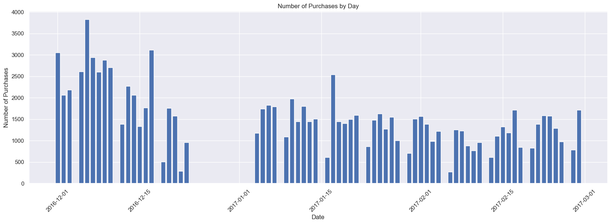
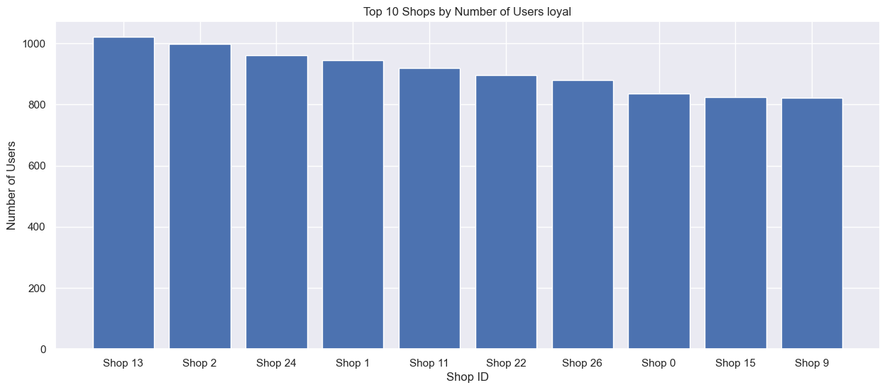

# Retail - Loyalty Program Analysis
Project portfolio : Analyzing loyalty programs in retail business units

## 1. Business Understanding
Home World is a company engaged in retail building materials. Each customer has a membership card, where to join the loyalty program you can subscribe for $ 20 / month. The program includes discounts, special offers and gifts.

Objective :

**A. Loyalty Program Analysis :**

  - Assess changes in average purchase size for each cohort for loyalty program members/non-members.
  - Assess purchase frequency for loyalty program members/non-members.
      
**B. Hypothesis Testing :**

  - Test the hypothesis that the average purchase size is higher for loyalty program members than for non-members.
  - Formulate statistical hypotheses about the data from the data set and test them.
   
**C. Summary :**
    
  - Provide conclusions from the results of data analysis.
  - Provide solutions or suggestions based on the results of the analysis.

## 2. Data Understanding
There are 2 datasets namely `retail_dataset_us.csv` and `product_codes_us.csv`. This dataset includes the following columns:

Dataset `retail_dataset_us.csv`:

- `purchaseId` — A unique identification number for each purchase transaction.
- `item_ID` — A unique identification number for each item purchased in a transaction.
- `purchasedate` — The date and time the purchase transaction was made.
- `Quantity` — The number of items purchased in one transaction.
- `CustomerID` — A unique identification number for each customer.
- `ShopID` — A unique identification number for each retail store.
- `loyalty_program` — Indicates whether the customer is a member of the loyalty program or not.

Dataset `product_codes_us.csv`:

- `productID` — A unique identification number for each product.
- `price_per_one` — Price per unit (units) of the product.

## 3. Data Preparation
In this process, we prepare data so that it is easier to analyze. Some of the steps we take are :

- Fix Column Name
- Remove Duplicated
- Handling Missing Values
- Convert Data Types

## 4. Exploratory Data Analysis
### A. Statics Summary
The statistical summary function that is commonly used in data analysis is describe() in the pandas library. This function provides summary descriptive statistics for each numeric column in the DataFrame, including data count, mean, standard deviation, minimum value, quartile, and maximum value.

### B. Univariate Analysis
- Distribution on the retail table  

  
- Distribution on the product table  

### C. Bivariate Analysis
- Number of purchases by day  
  
  
- Number of transactions by day with loyalty program  

- Loyalty Program Distribution  

- Top 10 shop by number of users  

- Top 10 shop by number of users loyal  

- Number of purchases per customer  

  Number of Loyal Customers: 587  
  Number of Non-Loyal Customers: 1163  
  Average Purchase per Loyal Customer: 39.77342419080068  
  Average Purchases per Non-Loyal Customer: 69.46431642304385
  
- Average purchase size
  
  Average Purchase Size for Loyalty Program Customers: 5.243564483659571  
  Average Purchase Size for Non-Loyalty Program Customers: 4.80166363400052

- Purchase frequency for loyal program member / non meber

  Frequency of Purchases for Loyalty Program Customers: 23347  
  Frequency of Purchases for Non-Loyalty Program Customers: 80787

### D. Multivariate Analysis
- Correlation  

 
### E. Cohort Analysis
- Retention by month  

- Retention loyalty program  

## 5. Hypothesis Test
- Difference between the number of items between the loyalty member group and the non-loyalty member group

  Uji Wilcoxon signed-rank test:  
  Statistik uji: 78691898.5  
  Nilai p: 4.4824403569261315e-28  
  The null hypothesis is rejected. There is a significant difference between the number of items between the loyalty member group and the non-loyalty member group.

- Difference between the price per one product unit between the loyalty member group and the non-loyalty member group

  Uji Wilcoxon signed-rank test:  
  Statistik uji: 118448902.5  
  Nilai p: 5.341625093243979e-05  
  The null hypothesis is rejected. There is a significant difference between the price per one product unit between the loyalty member group and the non-loyalty member group.

- Difference between the total sales between the loyalty member group and the non-loyalty member group

  Uji Wilcoxon signed-rank test:
  Statistik uji: 118846101.0
  Nilai p: 1.230708467677431e-19
  The null hypothesis is rejected. There is a significant difference between the total sales between the loyalty member group and the non-loyalty member group.

## 6. Conclusion
- This dataset contains retail data from 1 December 2016 to 28 February 2017 or about 3 months. Transactions do not occur every day, especially from the end of December to January 1. There may be no transactions due to the year-end holiday. The highest transaction was at the beginning of December, after that the transaction rose and fell but never exceeded the highest transaction in December.

- Only 33.5% or 587 users join program_loyalty. The majority of users have not used the loyalty program in their transactions. For shops with customers using the loyalty program, shop 13 then shop 2 and shop 24.

- There is a difference between the average purchase per customer between loyal and non-loyal customers. Loyal customers have an average of 39 purchases per customer, while non-loyal customers have an average of 69 purchases per customer. The average purchase per non-loyal customer is greater than the average purchase per loyal customer.

- Overall, this analysis shows that price per item has the strongest positive correlation with total sales, followed by quantity purchased. However, the correlation between loyalty program status and total sales is very small.

- Customer retention with a loyalty program does not show a better comparison than retention with users without a loyalty program. Customer retention without a loyalty program is higher in the first month, namely 41% compared to users with a loyalty program, only 33% in the first month. Whereas in the second month users with a higher loyalty program were 35% and 33% without a loyalty program.

- Based on the very small p-value (smaller than the specified level of significance), we can conclude that there is a significant difference between the purchase size of loyalty program members and non-members. We can reject the null hypothesis that there is no significant difference and accept the alternative hypothesis that the average purchase size is significantly higher for loyalty program members than for nonmembers. Based on the results of statistical tests, we can conclude that loyalty program members tend to have a significantly higher purchase size than non-members.

- Member fees $ 20 per month, discount or other benefits need to be reviewed. This refers to purchases per loyal customer which are still smaller than non-loyal customers. Loyalty program customer retention also did not increase significantly compared to non-loyalty customer retention. If there is no improvement in the loyalty program benefits, it is likely that customers tend to choose transactions without a loyalty program.

## 7. Dashboard
 

